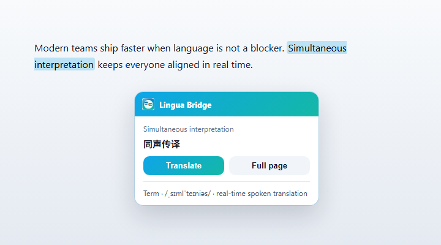
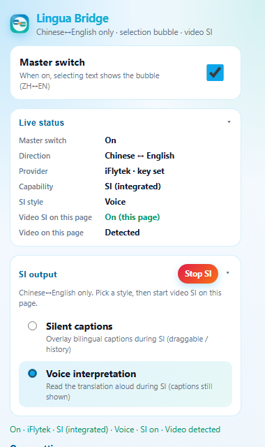
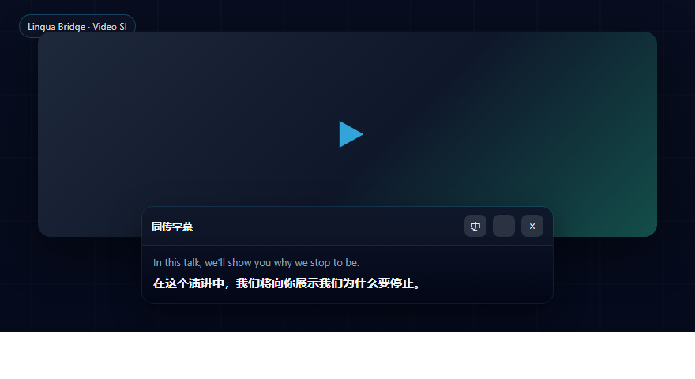
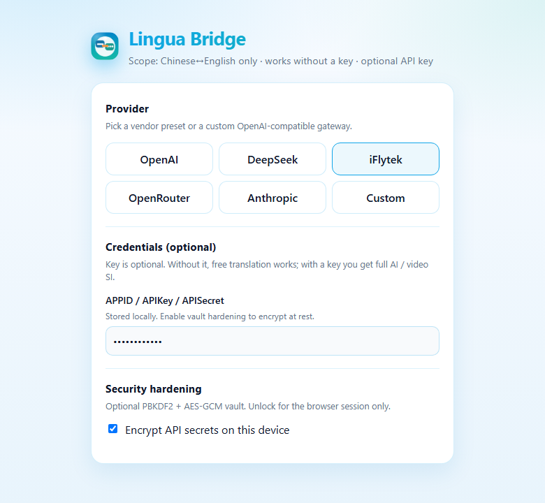

# Lingua Bridge

[English](./README.md) | **中文**

<p align="center">
  
</p>

**Lingua Bridge** 是一款 Chrome / Firefox 浏览器扩展，**仅做中英互译（Chinese ↔ English）**。  
把日常浏览与看视频变成无缝双语体验：划词出气泡、需要时整页翻译，或开启**视频同声传译**——可拖动双语字幕，可选语音朗读译文。

无需再复制粘贴到外部翻译工具。不支持其他语种——产品刻意聚焦中英，以便识别、翻译与语音合成更稳。

| | |
|---|---|
| **平台** | Chrome、Edge、Firefox（MV3 / Firefox 包） |
| **核心** | 划词气泡 · 整页翻译 · 视频同传 |
| **同传样式** | 静默字幕 · 语音传译 |
| **供应商** | OpenAI 兼容、DeepSeek、科大讯飞、OpenRouter、Anthropic、自定义 |
| **密钥** | 可选——无 Key 可用免费路径；配置后 AI / 视频音轨同传更强 |
| **界面语言** | 跟随浏览器/系统（`en` / `zh_CN` / `zh_TW`） |
| **版本** | **v0.4.29** |

---

## 能做什么

### 1. 划词气泡（默认）

打开主开关后，在普通网页选中中文或英文，旁侧出现气泡：**翻译**、**整页**，并尽量附带简要词条说明。

<p align="center">
  
</p>

### 2. 浮层控制台

点击工具栏图标，在**当前网页**打开可拖动控制台（右上角 × 关闭；点击页面其他区域**不会**自动关闭）。内含主开关、**实时状态**（供应商、同传样式、本页是否同传中、是否检测到视频），以及同传输出模式。

<p align="center">
  
</p>

### 3. 视频同声传译

在有可播放视频的页面，选好样式后开启同传：

- **静默字幕** — 双语浮层（可拖动、历史、折叠/关闭）
- **语音传译** — 朗读译文，同时仍显示字幕

关闭字幕浮窗会同步关闭同传，并更新弹窗按钮与实时状态。

<p align="center">
  
</p>

### 4. 设置与本机安全

选择供应商，可选填写密钥，并开启**会话保险库**（PBKDF2 + AES-GCM），密钥仅加密存于本机。本项目**无自建后端**，Key 不会上传到 Lingua Bridge 服务器。

<p align="center">
  
</p>

---

## 功能对照

| 能力 | 无 API Key | 有 API Key |
|------|------------|------------|
| 划词翻译 / 讲解 | 免费引擎 + 简要词提示 | AI 译文 + 关键词讲解 |
| 整页翻译 | 可选 | 可选 |
| 视频同传 | 麦克风 Web Speech（降级） | 视频音轨 STT + TTS |
| 密钥加密保险库 | — | 可选 |

---

## 一键打包（Windows / Linux / macOS）

产出 Chrome + Firefox 可安装 zip：

```bash
npm run pack:all          # 推荐
# Windows:
pack.cmd
# Linux / macOS:
chmod +x pack.sh && ./pack.sh
# 或:
make pack
```

跳过测试加快打包：`npm run pack:all -- --skip-test` 或 `./pack.sh --skip-test`

重新生成 README 截图（可选）：

```bash
node scripts/capture-readme-shots.mjs
```

## 安装到浏览器

打包产物是**标准扩展包**，可在浏览器「扩展程序」页加载（开发者/临时模式）。  
这与应用商店里点「添加至 Chrome」的永久安装不是同一路径（见下方限制）。

```bash
npm install             # 首次
npm run pack:all
```

产物目录：`.output/`（含 `chrome-mv3/`、`firefox-mv2/` 与 `*-chrome.zip` / `*-firefox.zip`）。

### Chrome / Edge（推荐）

1. 完成打包（`npm run pack:all` 或 `pack.cmd`）
2. 打开 `chrome://extensions`（Edge：`edge://extensions`）
3. 打开右上角 **开发者模式**
4. 任选其一安装：
   - **推荐**：点 **加载已解压的扩展程序** → 选择目录 `.output/chrome-mv3`
   - 或将 `.output/omnipilot-lingua-bridge-*-chrome.zip` 拖到扩展页（视环境而定）

### Firefox

1. 打开 `about:debugging#/runtime/this-firefox`
2. 点 **临时载入附加组件**
3. 选择 `.output/firefox-mv2` 下的 `manifest.json`，或对应的 `*-firefox.zip`

说明：临时载入在浏览器重启后可能失效；长期安装一般需经 [Firefox AMO](https://addons.mozilla.org/) 签名上架。

### 限制（不能直接做到的）

| 期望 | 实际情况 |
|------|----------|
| 像商店一样一键「添加至 Chrome」且永久安装 | 未上架时**做不到**；需开启开发者模式后本地加载 |
| 完全不开发者模式也能安装未签名包 | Chrome 对未签名扩展有限制；日常本地请用「开发者模式 + 加载已解压」 |
| Firefox 一次加载永久生效 | 临时载入会随重启失效；永久需 AMO 签名 |

## 使用

1. 点击工具栏图标打开浮层控制台，打开主开关（**默认划词气泡**，不会整页自动刷译）
2. 在页面上**选中文字** → 旁侧气泡：**翻译**（附带词条说明）/ **整页**
3. 视频同传：选 **静默字幕** 或 **语音传译**，再在视频页点 **开启同传**
4. （可选）在设置中配置 API Key，讲解与视频音轨同传更稳

同传进行中切换样式会立刻开/关朗读；关闭字幕浮窗会同步关闭同传并更新弹窗状态。

## API Key 安全

本扩展**无自建后端**：Key 只存在你本机浏览器的扩展存储（`storage.local`），不会上传到本项目的任何服务器。

| 措施 | 说明 |
|------|------|
| 隔离调用 | 仅 **background** 读取 Key 并带 `Authorization` 请求；网页 content **不加载** Key |
| 公开偏好 | `local:publicPrefs`：`enabled` / `speechMode` / `hasApiKey`（无 Key 原文） |
| 可选加密 | 设置页「安全加固」：PBKDF2 + AES-GCM；口令**会话解锁**（不落盘自动解锁） |
| Base URL | **仅允许 https**；非 `api.openai.com` 须勾选「确认端点可信」 |
| 选项页 | 不回填完整密钥；不支持的 STT/TTS 不展示填写 |
| 弹窗 | 只读公开偏好，不加载原始 Key |
| 滥用抑制 | background 对 `ai.*` 按标签页限流 |
| 错误消毒 | 返回文案去掉密钥原文 |
| 构建断言 | `npm run assert:content` 确保 content 包不含 `apiKey` / `local:settings` |

**仍须注意（扩展无法绝对消除）：**

- Key 会发送到你确认过的 **Base URL**（钓鱼端点仍会骗走 Key——请只填可信服务）
- 本机恶意软件 / 能读浏览器配置目录的程序仍可能读到 `storage.local`
- 请勿把含 Key 的截图、导出包或调试日志发给他人

## 开发

```bash
npm run dev           # Chrome
npm run dev:firefox
npm test
make deploy           # 测试 + 双浏览器构建
```

## 版本

**v0.4.29** — 中英同传、静默/语音样式同步、关闭字幕浮窗时同步按钮与实时状态、界面 i18n。
